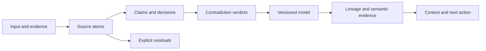

# FOAAP Engine

[](https://github.com/imperiobaal69-web/foaap-engine-public/actions/workflows/test.yml)

**A stateful context engine for AI applications.**

An application sends claims, decisions and evidence. The engine maintains a typed model of the situation: what is believed, what conflicts, what changed, and which action follows. A new answer does not silently replace the reasoning that came before it.

This is a public source reference extracted from FOAAP Engine. It includes the core model, HTTP adapter, MCP client, persistence contracts and executable tests. It runs independently of the private FOAAP deployment.

## Start with a working example

Requires Node.js 22 or later. The first two commands need no dependencies, credentials, database or model provider.

```sh
npm run demo
npm run test:core

# Include the MCP contract test:
npm ci --ignore-scripts --prefix mcp
npm test
```

The demo adds two conflicting launch commitments, records an explicit verdict, surfaces the conflict as the next action, and records the replacement in the claim's lineage. All example data is fictional. See [examples/state-walkthrough.mjs](examples/state-walkthrough.mjs).

## Decisions worth inspecting

| Problem | Implementation | Evidence |
| --- | --- | --- |
| A later answer obscures an earlier commitment | Claims, decisions and contradictions are separate objects; a resolution records a supersession edge. | [model.js](engine/model.js), [model tests](test/model.test.mjs) |
| Extraction quietly drops inconvenient input | Every source atom must be projected into structure or retained as an explicit residual. | [coverage.js](engine/coverage.js), [coverage tests](test/coverage.test.mjs) |
| A model returns only part of a comparison batch | The judge processes every candidate pair and rejects partial verdict sets. | [contradict.js](engine/contradict.js), [judge tests](test/contradict.test.mjs) |
| New evidence erases the history of disagreement | Semantic bonds retain support, opposition, predictions and observed outcomes separately. Their current interpretation can change. | [bonds.js](engine/bonds.js), [bond tests](test/bonds.test.mjs) |
| Two clients save conflicting versions | A row lock and caller-supplied base version turn stale writes into explicit conflicts. | [Postgres persistence contract](supabase/engine-schema.sql) |
| An agent depends on undocumented API behavior | An MCP client speaks to an isolated mock API through the SDK transport. | [MCP implementation](mcp/index.mjs), [contract test](mcp/test/api-contract.test.mjs) |

The current suite has **29 tests**: 20 original core tests, seven message-persistence regression tests, one portfolio-walkthrough test and one MCP contract test containing multiple request/response assertions. The contract test exercises the client against a mock API; it is not a deployment or database integration test.

## The flow



The ontology is data: axes, workstreams and prerequisites live in [engine/ontology.js](engine/ontology.js) and [lib/](lib). Model providers can propose extraction and verdicts; deterministic code owns the shapes, confidence gates and state transitions. Those checks do not establish that a model's interpretation is true.

## API and MCP

`api/v1.js` is a Request/Response adapter for spaces, context, events, verdicts, evidence, exports and keys. `server.js` hosts it locally, bound to loopback, with an in-memory rate limiter. The public adapter serves this README instead of the private console.

```sh
npm run dev
curl http://localhost:8787/
```

The pure core and tests work without setup. Authenticated persistence needs your own Supabase deployment and server-side configuration; see [.env.example](.env.example). The SQL files document the model and event contracts and assume existing workspace/auth tables. They are not a complete empty-database bootstrap.

The MCP client defaults to `http://localhost:8787/api/v1`. Set `FOAAP_BASE_URL`, `FOAAP_API_KEY` and optionally `FOAAP_SPACE` for your own deployment. No command here uses FOAAP's production credentials or connects to its production account by default.

## Boundaries

- Production secrets, account identifiers, deployment metadata, internal handoffs and historical logs are excluded. This repository begins with a separate publication history.
- The reference retains the original core algorithms. Publication changes remove a production workspace exemption and hosted-service defaults, and replace private development pages with this README.
- SQL migrations, managed-model integrations, production authorization and distributed quotas are not certified by the local test suite. The API adapter is source for review, not a promise of production readiness.
- No performance or model-quality benchmark is claimed. The examples and tests use synthetic data.

Built by **Paulo Villalobos**. [Portfolio](https://paulo.foaap.app/).

## Product reliability repair

The message record adapter in [reliability/conversation-records.js](reliability/conversation-records.js) is the same module used by the accompanying FOAAP app repair. It retains message identity, terminal status, timestamps and tool metadata. Replayed writes with the same message ID and session replace the record instead of appending a duplicate. Legacy records remain readable.

[Regression tests](test/conversation-records.test.mjs) exercise persistence/reload, replay and session boundaries. [The integration patch](reliability/atelier-persistence.patch) shows the wiring into the private app. The private app build and a storage-adapter integration test passed locally; this public suite does not run the full app or certify its production deployment. This is a local persistence repair, not a solution for distributed retries or remote sync failures.

The [read-only portfolio demo](https://paulo.foaap.app/demo) uses snapshots generated by [examples/portfolio-walkthrough.mjs](examples/portfolio-walkthrough.mjs). Its verdicts and project data are synthetic; the state transitions run the actual public engine.
